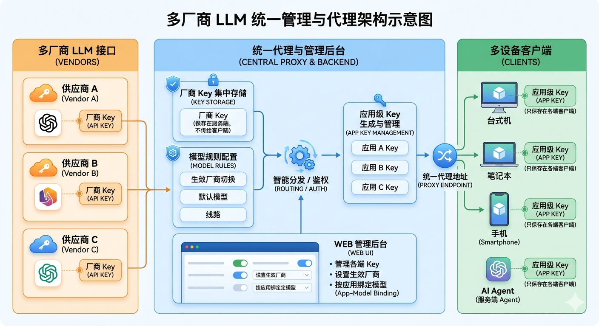
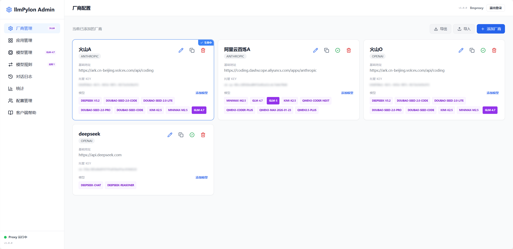
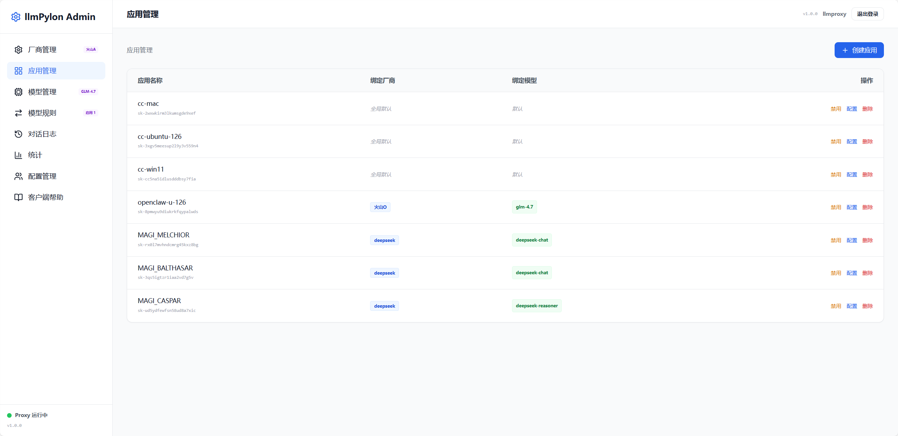
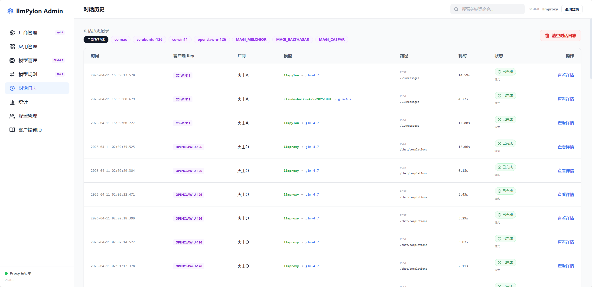
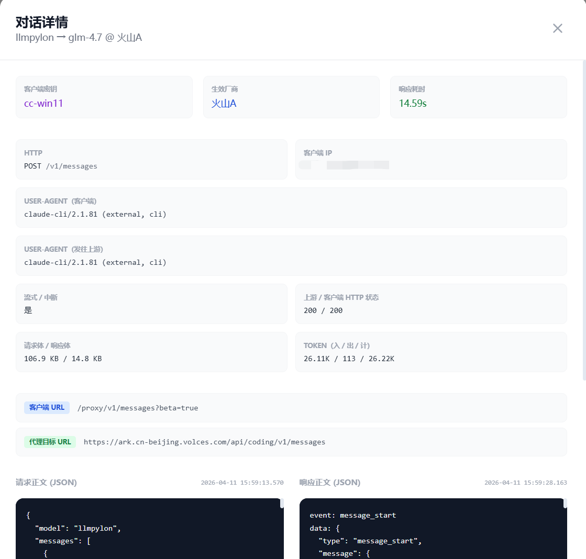

**简体中文** · [English](README.en.md)

<div align="center">

# 🔥 llmPylon

**一个代理，所有 AI 工具，无需厂商绑定**

*Self-hosted LLM API proxy — manage all your AI tools through one endpoint*

[](LICENSE)
[](https://hub.docker.com/r/apache3/llmpylon)


</div>

---

<p align="center">
  
</p>

## 为什么选择 llmPylon？

如果你**同时订阅了多家大模型厂商**，又在**多台设备**上使用不同的 AI 工具（OpenCode、Claude Code、Cursor……），你大概率遇到过这些麻烦：

| 痛点 | llmPylon 怎么解决 |
|------|------------------|
| 每个工具都要填一遍 API Key | 厂商 Key **只保存在服务端**，客户端只用简短的应用 Key |
| 换模型要逐个客户端改配置 | 后台**一键切换**生效厂商，所有客户端立即生效 |
| 各厂商协议不兼容 | **OpenAI ↔ Anthropic 双向协议自动转换** |
| 不知道哪个应用在用什么模型 | 实时对话日志 + 统计分析，每个请求来源一目了然 |

**llmPylon** 就是一个放在你自己服务器上的**统一代理 + 管理后台**。一行 Docker 命令即可启动。

> ⚠️ **不要直接暴露到公网。** 请仅在受信任网络或做好接入层防护后使用。

---

## 🚀 快速开始

```bash
docker run -d \
  --name llmpylon \
  -p 3000:3000 \
  -v llmpylon-data:/data \
  apache3/llmpylon
```

浏览器打开 `http://<你的IP>:3000`，默认账号登录后**立即修改密码**：

- 用户名：`llmpylon`
- 密码：`llmpylon`

### 客户端配置

在任何 AI 工具中填入：

| 设置项 | 值 |
|--------|-----|
| Base URL | `http://你的IP:3000/proxy` |
| API Key | 在「应用管理」中创建应用后复制 |
| Model | `llmpylon`（大小写不敏感） |

OpenAI 协议客户端使用 `/proxy/v1/chat/completions`，Anthropic 协议客户端使用 `/proxy/v1/messages`。

```bash
# 示例：cURL 调用
curl -X POST http://localhost:3000/proxy/v1/chat/completions \
  -H "Content-Type: application/json" \
  -H "Authorization: Bearer YOUR_APP_KEY" \
  -d '{"model":"llmpylon","messages":[{"role":"user","content":"你好"}]}'
```

---

<p align="center">
  
  <br><em>厂商管理 — 一键切换活跃厂商</em>
</p>

<p align="center">
  
  <br><em>应用管理 — 每个应用独立密钥与颜色</em>
</p>

<p align="center">
  
  <br><em>实时对话日志 — 追踪每个请求的路径与状态</em>
</p>

<p align="center">
  
  <br><em>日志详情 — 对比原始与转换后的请求/响应</em>
</p>

---

## ✨ 功能一览

| | |
|---|---|
| ✅ **多厂商代理** | 配置多个 API 提供商，一键切换当前生效厂商 |
| ✅ **双向协议转换** | OpenAI ↔ Anthropic 双向自动转换，支持流式 SSE 与工具调用 |
| ✅ **密钥托管** | 厂商 API Key 只保存在服务端；客户端仅使用应用级 Key |
| ✅ **模型规则** | 通配符映射（如 `gpt-4*` → 实际模型），支持优先级排序 |
| ✅ **应用维度绑定** | 每个应用可独立绑定厂商与默认模型，不受全局切换影响 |
| ✅ **`llmpylon` 魔力模型名** | 自动解析为 应用绑定 → 厂商默认 → 全局默认（**大小写不敏感**） |
| ✅ **消息通知** | 对话完成时自动 HTTP 推送；自定义 URL、Headers、JSON 模板、冷却时间 |
| ✅ **实时对话日志** | WebSocket 实时推送；详情页对比原始/转换后请求响应；分页与筛选 |
| ✅ **统计面板** | 请求趋势图、模型分布、活动热力图、P50/P90/P99 延迟百分位、Top 慢/错请求 |
| ✅ **回收站** | 厂商与应用均支持软删除 → 恢复 → 彻底删除，数据不丢失 |
| ✅ **导入导出** | 单厂商或全局配置 JSON 导入导出，含回收站和转换开关 |
| ✅ **多管理员** | 多用户账号管理，支持创建、编辑、删除与强制修改密码 |
| ✅ **运行时配置** | 日志保留天数、上游超时、请求头黑名单、流式重试参数，全在界面配置 |
| ✅ **Docker 一键部署** | 数据卷持久化，启动时自动迁移数据库 |

---

## 🔧 升级

**Docker（推荐）：**

```bash
docker pull apache3/llmpylon
# 停止旧容器，用相同数据卷重建
docker stop llmpylon && docker rm llmpylon
docker run -d --name llmpylon -p 3000:3000 -v llmpylon-data:/data apache3/llmpylon
```

**源码：**
```bash
git pull && npm install && cd client && npm run build && cd .. && npm run server
```

每次启动自动执行数据库迁移，数据不丢失。版本号在根 `package.json`，后台和 `/healthz` 均会显示。

---

## 📡 API 速查

| 路径 | 说明 |
|---|---|
| `POST /proxy/*` | LLM 代理入口（OpenAI / Anthropic） |
| `GET /healthz` | 健康检查（含版本号） |
| `POST /api/auth/login` | 管理员登录 |
| `/api/providers/*` | 厂商（含转换开关、回收站、导入导出） |
| `/api/keys/*` | 应用密钥（含回收站、启用/禁用、颜色） |
| `/api/models/*` | 模型管理（拖拽排序、按厂商筛选） |
| `/api/model-rules/*` | 模型规则（通配符映射） |
| `/api/notification-configs/*` | 通知 Webhook 配置 |
| `/api/notification-logs` | 通知推送日志 |
| `/api/config/export` / `import` | 全局配置导入导出 |
| `/api/stats` | 统计分析（含热力图、百分位、CSV 导出） |
| `/api/logs` | 对话日志（含转换前后对比） |
| `/api/users/*` | 管理员账号管理 |

---

## 🛠 本地开发

需要 Node.js 20+。

```bash
npm install
cd client && npm install && cd ..
npm run dev        # 后端 :3000 + Vite :5173
npm run server     # 生产模式
```

详见 [.env.example](.env.example)。

---

## ⚙️ 环境变量

| 变量 | 默认 | 说明 |
|---|---|---|
| `PORT` | `3000` | HTTP 端口 |
| `DB_PATH` | `database.sqlite` | SQLite 路径；Docker 内为 `/data/database.sqlite` |
| `NODE_ENV` | — | 生产可设为 `production` |

---

## 🧱 技术栈

Node.js · Express · SQLite · Socket.io · Vue 3 · Vite · Tailwind CSS · ECharts

---

## 📄 许可证

**[GNU Affero General Public License v3.0 only](LICENSE)**（AGPL-3.0-only）
